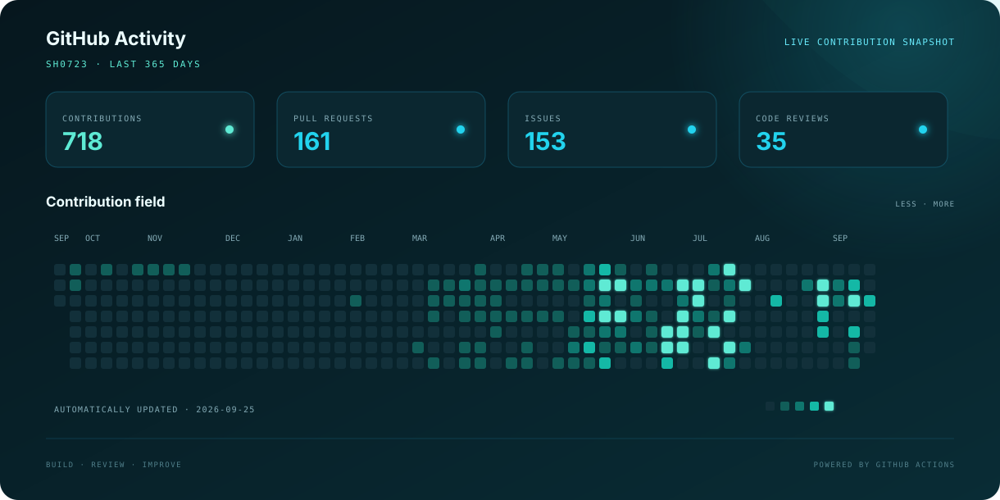

# sh0723

### Backend Developer

팀이 이해하고 이어갈 수 있는 서버 구조를 고민하는 백엔드 개발자입니다.

## About

- Java와 Spring Boot를 중심으로 백엔드 서비스를 개발하고 있습니다.
- 명확한 책임 분리와 함께 유지보수할 수 있는 코드를 중요하게 생각합니다.
- 알고리즘 문제를 꾸준히 풀고 더 나은 해결 방법을 기록합니다.

## Awards

| Date | Award |
| --- | --- |
| **2024.08.16** | **교내 소프트웨어 공모전 은상** |

## Experience

| Period | Organization & Role |
| --- | --- |
| **2025.01 — 2025.02** | **두산 스코다 파워** 인턴 · IT부서 |

## Tech

  
  
  
  
  
  
  

## Selected Work

| Project | Description |
| --- | --- |
| [Team PO](https://github.com/Team-po/Server) | 팀 구성과 협업 경험을 연결하는 서비스의 백엔드 |
| [AlgoHub](https://github.com/GAMZA-BAT/algohub-server) | 알고리즘 스터디 그룹을 위한 플랫폼의 백엔드 |
| [Algorithm-SH](https://github.com/sh0723/Algorithm-SH) | 알고리즘 문제 풀이와 해법을 꾸준히 기록하는 저장소 |

## GitHub Activity

  

